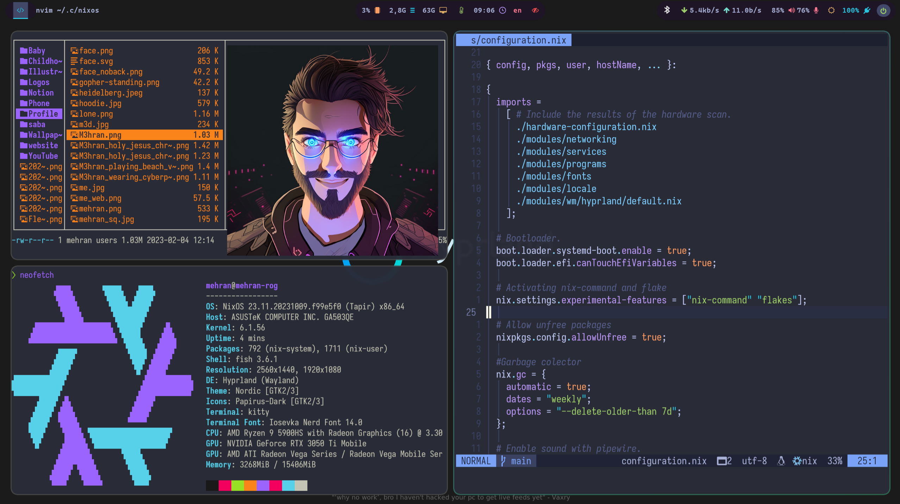

# My NixOS Configuration
[](https://opensource.org/licenses/MIT)
[](https://GitHub.com/m3hransh/nixos-conf/issues/)
[](https://GitHub.com/m3hransh/nixos-conf/pull/)


This repository hosts my personal NixOS configuration managed using flakes to ensure a reproducible system setup.
## Table of Contents
- [My NixOS Configuration](#my-nixos-configuration)
  - [Table of Contents](#table-of-contents)
  - [Directory Structure](#directory-structure)
  - [Prerequisites](#prerequisites)
  - [Usage](#usage)
  - [Inspirations](#inspirations)
  - [Contributing](#contributing)
  - [License](#license)

## Directory Structure
These are main files of configuration.
[flake.nix](./flake.nixy) is the entry point where you specify the inputs
and load two main modules namely [configuration.nix](./system/configuration.nix) and
[home.nix](./home/home.nix).
**home** folder contains packages that aren't related to the system. **home/programs** modularizes
some main packages that contain extra configs (e.g. nvim) beside their config files.

```bash
├── apply.sh
├── flake.lock
├── flake.nix
├── README.md
├── system
│   ├── configuration.nix # main system modules that import others and set up general conf
│   ├── hardware-configuration.nix # this might change depending on your machine spec
│   └── modules
│       ├── fonts # specify the font packages
│       ├── locale # time and locale settings
│       ├── networking # all network related services
│       ├── programs # system level packages and programs 
│       ├── services # general system level services
│       └── wm
│           └── hyprland # services and packages related to hyprland
└─ home
    ├── home.nix # home manager module where imports other programs
    ├── programs
    │   ├── default.nix
    │   ├── dunst
    │   ├── hypr
    │   ├── imageview
    │   ├── kooha
    │   ├── mpv
    │   ├── music
    │   ├── nvim
    │   ├── obs-studio
    │   ├── ranger
    │   ├── resource_monitor
    │   ├── search
    │   ├── vscode
    │   ├── waybar
    │   ├── wofi
    │   ├── youtube-tui
    │   ├── yt-dlp
    │   └── zathura
    └── scripts
```
## Prerequisites

- NixOS
- Flakes feature enabled

## Usage
1. Ensure your machine specifications are correctly reflected in [hardware-configuration.nix](./system/hardware-configuration.nix).
2. Open [flake.nix](./flake.nix) and update the **user** and **hostName** variables to match your preferences.
3. To apply the configuration to your system, run the following command:
```bash
nixos-rebuild switch --flake '.#yourhostname'
```

## Inspirations
- [Ruixi-rebirth/flakes](https://github.com/Ruixi-rebirth/flakes.git)
- [HeinzDev/Hyprland-dotfiles](https://github.com/HeinzDev/Hyprland-dotfiles.git)

## Contributing
Feel free to open issues or PRs if you have suggestions or improvements!

## License
This project is licensed under the MIT License - see the [LICENSE.md](LICENSE.md) file for details
