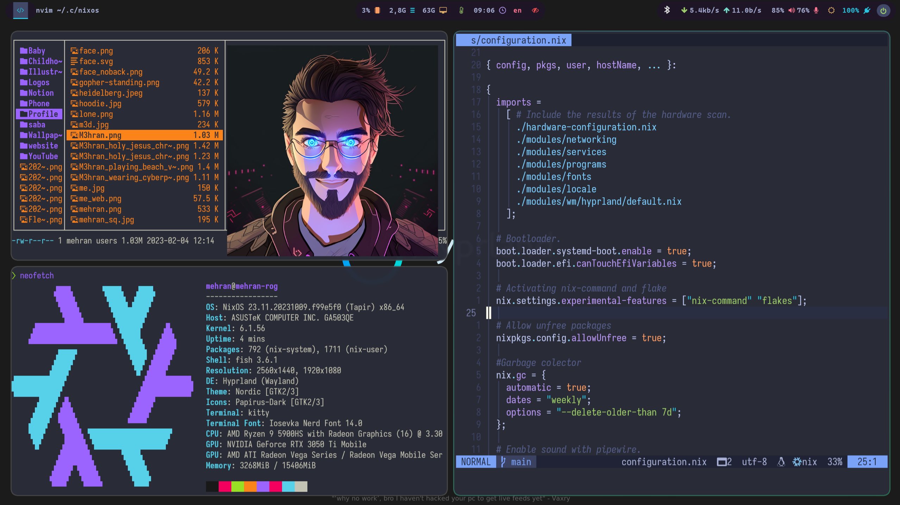

# Mehran's NixOS Configuration

[](https://opensource.org/licenses/MIT)
[](https://nixos.org)
[](https://hyprland.org)



A fully declarative, flake-based NixOS configuration for a Hyprland desktop environment. Supports **dual hardware profiles** (AMD desktop / NVIDIA laptop), **Home Manager** for user-level dotfiles, **Stylix** for unified theming, and an **Ubuntu** home-manager profile for non-NixOS machines.

---

## Table of Contents

- [Features](#features)
- [Directory Structure](#directory-structure)
- [Architecture](#architecture)
- [Hardware Profiles](#hardware-profiles)
- [Window Manager (Hyprland)](#window-manager-hyprland)
- [Programs & Tools](#programs--tools)
- [Theming](#theming)
- [Settings](#settings)
- [Prerequisites](#prerequisites)
- [Installation](#installation)
- [Usage](#usage)
- [Key Bindings](#key-bindings)
- [Ubuntu Profile](#ubuntu-profile)
- [Suggested Improvements](#suggested-improvements)
- [Inspirations](#inspirations)
- [Contributing](#contributing)
- [License](#license)

---

## Features

- **Flake-based** -- fully reproducible builds with pinned dependencies
- **Dual hardware profiles** -- AMD (desktop with ROCm/RADV) and NVIDIA (ASUS laptop with PRIME offload)
- **Hyprland + UWSM** -- modern Wayland compositor with Universal Wayland Session Manager
- **Stylix theming** -- consistent Tokyo Dark theme across all applications
- **Home Manager** -- declarative dotfile management for 20+ programs
- **Data-driven config** -- `settings.toml` centralizes user/system variables
- **Secret management** -- sops-nix with age encryption for WireGuard keys and other secrets
- **`nh` rebuild tool** -- colored diffs, integrated garbage collection
- **Development environment** -- Neovim with 30+ language LSPs, Emacs, VS Code
- **Multimedia stack** -- PipeWire audio, MPD/ncmpcpp, OBS Studio, DaVinci Resolve
- **Multi-keyboard layouts** -- US, German, Iranian with Alt+Shift toggle
- **Ubuntu compatibility** -- standalone Home Manager profile for Ubuntu workstations

---

## Directory Structure

```
.nixconf/
├── flake.nix                    # Entry point: inputs, outputs, host definitions
├── flake.lock                   # Pinned dependency versions
├── settings.toml                # Centralized configuration variables
├── .sops.yaml                   # sops-nix age key configuration
├── install.sh                   # Fresh install script
│
├── system/                      # System-level NixOS modules
│   ├── amd/
│   │   ├── configuration.nix    # AMD desktop: ROCm, RADV, Ollama GPU accel
│   │   └── hardware-configuration.nix
│   ├── nvidia/
│   │   └── configuration.nix    # ASUS laptop: NVIDIA PRIME, CUDA, asusctl
│   ├── hardware-configuration.nix
│   ├── style.nix                # System-level Stylix theme
│   └── wm/
│       ├── hyprland/default.nix # Hyprland + greetd + portals + polkit
│       └── gnome/default.nix    # GNOME (alternative WM)
│
├── home/                        # Home Manager modules
│   ├── home.nix                 # Main home config, imports all programs
│   ├── style.nix                # Home-level Stylix (fonts, cursors, icons)
│   ├── scripts/default.nix      # Custom shell scripts
│   ├── programs/                # Per-program declarative configs
│   │   ├── nvim/                #   Neovim (extensive Lua config, 30+ LSPs)
│   │   ├── emacs/               #   Emacs (pgtk, treesitter, agda2)
│   │   ├── kitty/               #   Kitty terminal
│   │   ├── waybar/              #   Waybar status bar + custom modules
│   │   ├── wofi/                #   Wofi launcher
│   │   ├── mako/                #   Mako notification daemon
│   │   ├── tmux/                #   Tmux with vim-like navigation
│   │   ├── yazi/                #   Yazi TUI file manager
│   │   ├── zathura/             #   Zathura PDF viewer
│   │   ├── ranger/              #   Ranger file manager
│   │   ├── mpv/                 #   MPV video player
│   │   ├── vscode/              #   VS Code (FHS wrapper)
│   │   ├── zoxide/              #   Zoxide smart cd
│   │   ├── resource_monitor/    #   btop system monitor
│   │   ├── obs-studio/          #   OBS with plugins
│   │   ├── music/               #   MPD + ncmpcpp + cava
│   │   ├── nix-direnv/          #   Direnv + Nix integration
│   │   └── ...                  #   imageview, kooha, yt-dlp, etc.
│   └── wm/
│       ├── hyprland/            # Hyprland home config
│       │   ├── default.nix      #   Packages, hyprlock, hypridle
│       │   ├── hyprland.conf    #   Main Hyprland config (keybinds, animations)
│       │   ├── hyprland-environment.nix  # GPU-specific env vars
│       │   └── scripts/         #   Helper scripts
│       └── gnome/default.nix
│
├── themes/                      # Base16 theme definitions
│   ├── tokyodark.yaml           # Primary theme
│   ├── tokyo-night-dark.yaml
│   └── tokyodark-terminal.yaml
│
├── secrets/                     # Encrypted secrets (sops-nix / age)
│   └── wg0.conf                 #   WireGuard config (encrypted)
│
├── ubuntu/                      # Ubuntu-specific Home Manager profile
│   ├── home.nix                 # Minimal config (terminal tools only)
│   └── scripts.nix              # Dev utility scripts (rgff, rgf, etc.)
│
└── assets/                      # User icons, images
```

---

## Architecture

```
                  settings.toml
                       │
                       v
                   flake.nix
                   /       \
                  /         \
     nixosConfigurations   homeConfigurations
          │                     │        \
   ┌──────┴──────┐         home.nix    ubuntu/home.nix
   │             │             │
 nvidia/       amd/        programs/
 config.nix   config.nix   ├── nvim
   │             │          ├── waybar
   └──────┬──────┘          ├── kitty
          │                 └── ...
    system/wm/hyprland
    system/style.nix
```

**How it works:**

1. `flake.nix` reads `settings.toml` to determine the active machine profile (`ASUS` or `AMD`)
2. A `getPack` helper converts TOML string package names into actual nixpkgs derivations
3. System modules configure hardware, services, networking, and the display manager
4. Home Manager modules configure user programs, dotfiles, and the Hyprland session
5. Stylix propagates the Tokyo Dark theme to all supported applications

---

## Hardware Profiles

### AMD Desktop (`system/amd/configuration.nix`)

| Component | Configuration |
|-----------|--------------|
| GPU | AMD RADV driver, ROCm 6.4+ (RDNA4/RX 9000 support) |
| Compute | Ollama with ROCm GPU acceleration |
| Audio | PipeWire + WirePlumber + Bluetooth (AAC, APTX, LDAC) |
| Boot | systemd-boot (EFI) |
| VPN | WireGuard (wg0, encrypted via sops-nix) |
| Virtualization | Docker |

### NVIDIA Laptop (`system/nvidia/configuration.nix`)

| Component | Configuration |
|-----------|--------------|
| GPU | NVIDIA proprietary + PRIME offload (AMD iGPU + NVIDIA dGPU) |
| Compute | CUDA support |
| Vendor | ASUS-specific: asusctl, asusd |
| Power | Ryzen CPU power management, thermal controls |
| Audio | PipeWire + WirePlumber + Bluetooth |
| Boot | systemd-boot (EFI) |

Both profiles share: Fish shell, networking (NetworkManager), locale (en_US.UTF-8 / de_DE.UTF-8), timezone (Europe/Berlin), SSH (hardened), printing (CUPS), Nix flakes, and automatic garbage collection via `nh`.

---

## Window Manager (Hyprland)

The Hyprland setup uses the modern **UWSM** (Universal Wayland Session Manager) integration:

- **Display manager**: greetd with tuigreet (TUI greeter)
- **Status bar**: Waybar with custom modules (GitHub notifications, CPU/RAM/disk, media player, sunset tracker, power menu)
- **Launcher**: Wofi
- **Notifications**: Mako
- **Lock screen**: hyprlock
- **Screenshots**: grimblast (area capture, watermark support)
- **Wallpaper**: hyprpaper
- **Blue light filter**: hyprsunset
- **Color picker**: hyprpicker
- **XDG portals**: xdg-desktop-portal-hyprland + GTK

### Input

- **Keyboard layouts**: US, German (de), Iranian (ir) -- toggle with `Alt+Shift`
- **Touchpad**: Natural scroll, tap-to-click, drag lock
- **Layout**: Dwindle tiling

---

## Programs & Tools

### Development

| Tool | Purpose |
|------|---------|
| **Neovim** | Primary editor -- 30+ language LSPs, DAP, Telescope, Treesitter |
| **Emacs** | Secondary editor -- pgtk, treesitter grammars, Agda2 |
| **VS Code** | Tertiary editor (FHS wrapper) |
| **Git + lazygit** | Version control |
| **Docker + lazydocker** | Containerization |
| **Fish + starship** | Shell with modern prompt |
| **tmux** | Terminal multiplexer (vim-like bindings) |
| **nix-direnv** | Per-project Nix environments |

### Languages & Toolchains

Rust (rustc, cargo), Go, Node.js, Python, GCC, TLA+ (tlaplusToolbox)

### Neovim LSP Servers

TypeScript, Bash, Nil, Nixd, Lua, Go, Python (Pyright), Rust (rust-analyzer), Marksman (Markdown)

### Terminal Tools

| Tool | Purpose |
|------|---------|
| **kitty / ghostty** | Terminal emulators |
| **yazi / ranger** | TUI file managers |
| **btop** | System resource monitor |
| **zoxide** | Smart directory navigation |
| **fd, fzf, bat** | Modern find/fuzzy-find/cat replacements |
| **jq** | JSON processor |
| **httpie** | HTTP client |

### Multimedia

| Tool | Purpose |
|------|---------|
| **MPD + ncmpcpp + cava** | Music playback + visualizer |
| **OBS Studio** | Streaming/recording (with background removal, waveform plugins) |
| **DaVinci Resolve** | Video editing |
| **Audacity** | Audio editing |
| **MPV / VLC** | Video playback |
| **Zathura** | PDF viewer |
| **GIMP 3** | Image editing |

### Communication

Brave, Chrome, Telegram, Discord, Thunderbird, Spotify

---

## Theming

Theming is managed by [Stylix](https://github.com/danth/stylix) with a consistent **Tokyo Dark** palette:

| Setting | Value |
|---------|-------|
| **Theme** | Base16 Tokyo Dark (`themes/tokyodark.yaml`) |
| **Polarity** | Dark |
| **Font (monospace)** | Intel One Mono |
| **Font (emoji)** | Noto Monochrome Emoji |
| **Icons** | Papirus-Dark |
| **Cursor** | Bibata-Modern-Ice (22px) |
| **Terminal font size** | 18pt |
| **Application font size** | 12pt |

Stylix automatically applies the theme to: Kitty, GTK apps, Hyprland, Hyprlock, Waybar, and other supported targets.

---

## Settings

All configurable variables live in [`settings.toml`](./settings.toml):

```toml
[systemS]
system = "x86_64-linux"
hostName = "mehran-beast"
stateVersion = "25.05"
machine = "AMD"          # "AMD" or "ASUS" -- selects hardware profile
packages = [ ... ]       # System-level packages

[userS]
user = "mehran"
wm = "hyprland"          # Window manager selection
font = "Intel One Mono"
editor = "nvim"
packages = [ ... ]       # User-level packages

[ubuntu]
user = "mehranshahidi"   # Ubuntu workstation profile
packages = [ ... ]       # Minimal terminal tools
```

The `machine` field in `[systemS]` determines which hardware profile is built: `"ASUS"` selects the NVIDIA config, anything else selects AMD.

---

## Prerequisites

- **NixOS** (or any Linux for the Ubuntu home-manager profile)
- **Nix with flakes enabled**:
  ```nix
  nix.settings.experimental-features = [ "nix-command" "flakes" ];
  ```

---

## Installation

### Fresh NixOS Install

```bash
# Clone the repository
git clone https://github.com/m3hransh/nixos-conf.git ~/.nixconf
cd ~/.nixconf

# Generate hardware config for your machine
sudo nixos-generate-config --show-hardware-config > system/amd/hardware-configuration.nix

# Edit settings.toml to match your setup
$EDITOR settings.toml

# Build and switch (system)
sudo nixos-rebuild switch --flake '.#system'

# Build and switch (home)
home-manager switch --flake '.#mehran'
```

### Using install.sh

The included `install.sh` automates detection of boot mode (UEFI/BIOS), hardware config generation, and initial system build.

---

## Usage

### Rebuild System

```bash
# Full system rebuild
nh os switch ~/.nixconf

# Home Manager rebuild
nh home switch ~/.nixconf
```

### Shell Aliases (Fish)

| Alias | Command |
|-------|---------|
| `nb` | `nh os switch ~/.nixconf` |
| `hb` | `nh home switch ~/.nixconf` |
| `nn` | `neovide` |
| `nop <path>` | Evaluate and print NixOS option values |

### Update Flake Inputs

```bash
nix flake update        # Update all inputs
nix flake lock --update-input nixpkgs  # Update only nixpkgs
```

---

## Key Bindings

Main modifier: **Super** (Windows key)

### Window Management

| Binding | Action |
|---------|--------|
| `Super + Return` | Open Kitty terminal |
| `Super + Q` | Close focused window |
| `Super + F` | Toggle fullscreen |
| `Super + Space` | Toggle floating |
| `Super + P` | Toggle pseudotile |
| `Super + h/j/k/l` | Focus left/down/up/right |
| `Super + Shift + h/j/k/l` | Move window left/down/up/right |
| `Super + 1-0` | Switch to workspace 1-10 |
| `Alt + l/h` | Next/previous workspace |
| `Super + M` | Move workspace to next monitor |

### Utilities

| Binding | Action |
|---------|--------|
| `Super + [` | Screenshot (save to ~/Pictures) |
| `Super + ]` | Screenshot (copy to clipboard) |
| `Super + A` | Screenshot with watermark |
| `Super + ;` | Emoji picker |
| `Super + Shift + I` | Lock screen |
| `Super + -` | Send to scratchpad |
| `Super + =` | Toggle scratchpad |

---

## Ubuntu Profile

A lightweight Home Manager profile for Ubuntu workstations (no NixOS required):

```bash
home-manager switch --flake ~/.nixconf#ubuntu
```

Includes: Neovim, tmux, yazi, zoxide, btop, nix-direnv, and custom dev scripts (`rgff`, `rgf` for interactive ripgrep + fzf workflows).

---

## Suggested Improvements

Remaining improvements that could enhance this configuration:

1. **Integrate Home Manager as a NixOS module** -- single `nixos-rebuild switch` rebuilds everything atomically, with unified rollbacks.

2. **Consider `disko`** for declarative disk partitioning on reinstalls.

---

## Inspirations

- [Ruixi-rebirth/flakes](https://github.com/Ruixi-rebirth/flakes)
- [HeinzDev/Hyprland-dotfiles](https://github.com/HeinzDev/Hyprland-dotfiles)

---

## Contributing

Feel free to open issues or PRs if you have suggestions or improvements!

---

## License

This project is licensed under the MIT License -- see the [LICENSE.md](LICENSE.md) file for details.
